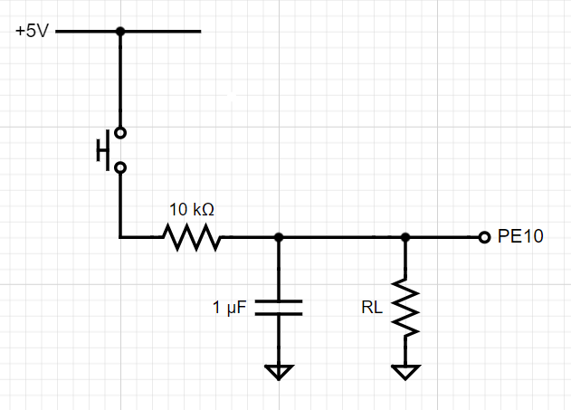

# Blink Test Project on stm32f407 Discovery Kit

In this project, the stm32 timer, GPIO ports, and
an external RC circuit are used.The RC circuit is utilized to debounce push button triggers.

## functinality

the circuit has two states: the hold state and the press state. 

Upon resetting the microcontroller, the four built-in LEDs will start turning on and off in a clockwise rotation. Pressing the push button will reverse the direction of the rotating LEDs. Holding the push button for 2 milliseconds will cause the LEDs to start blinking together. To change the behavior back to rotation, press the button once again.
